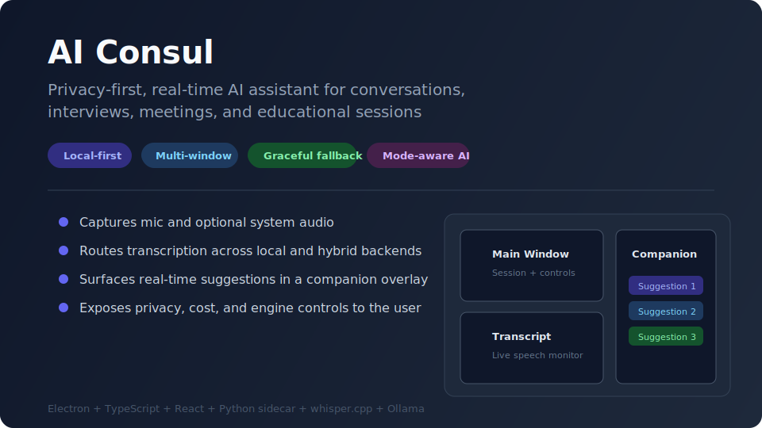
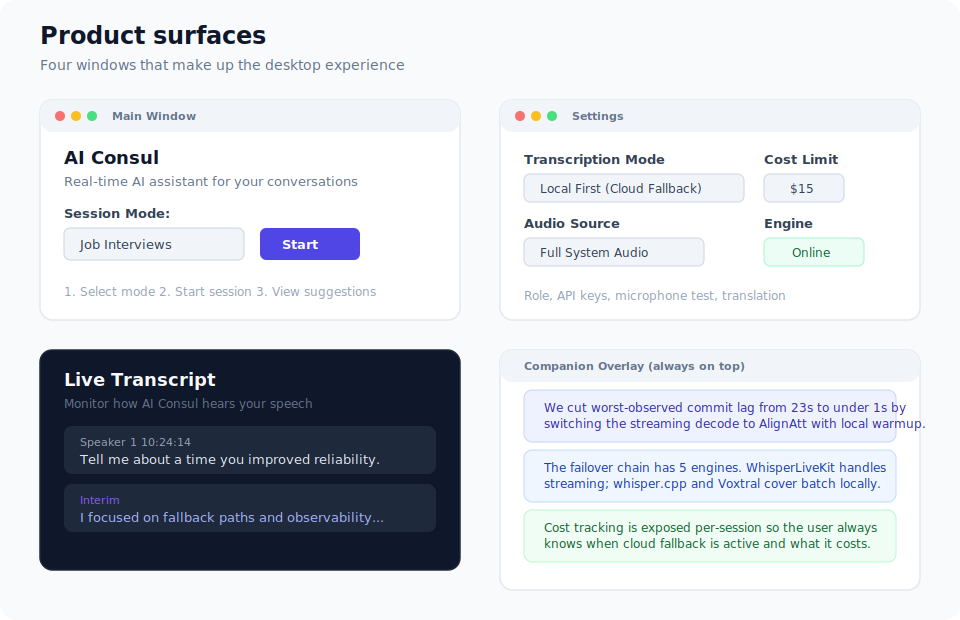
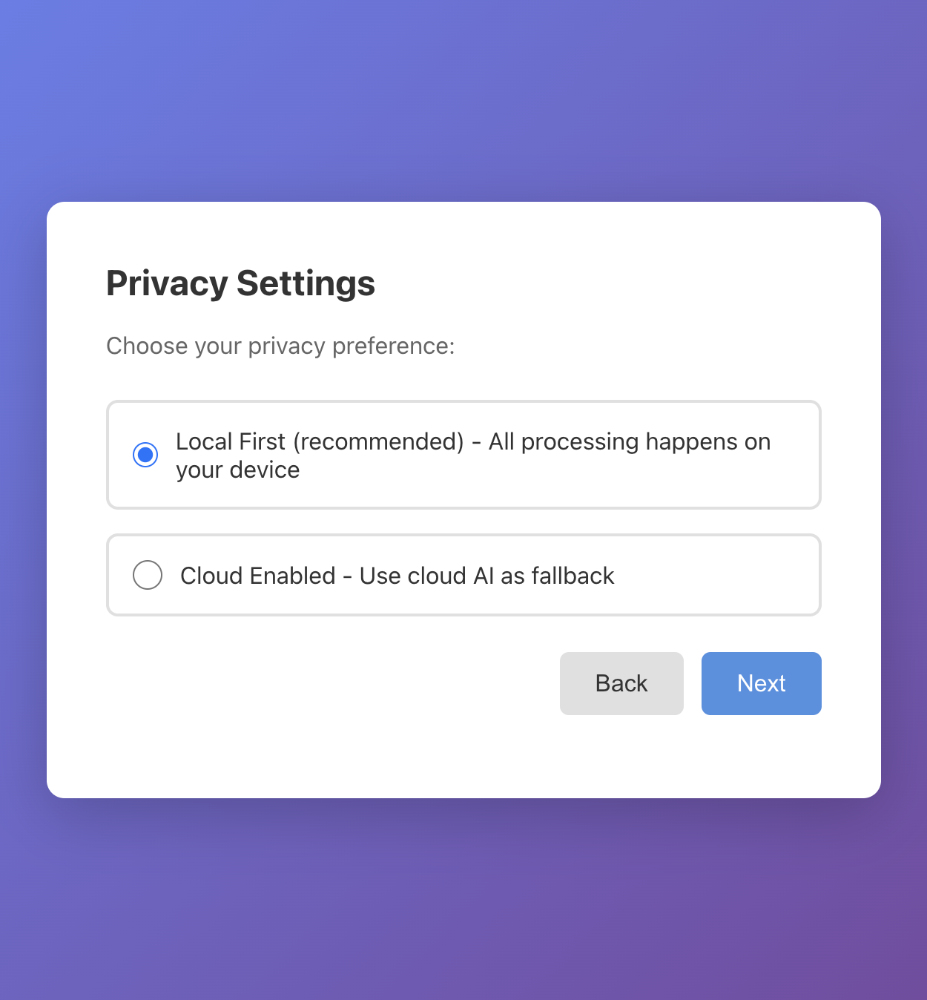
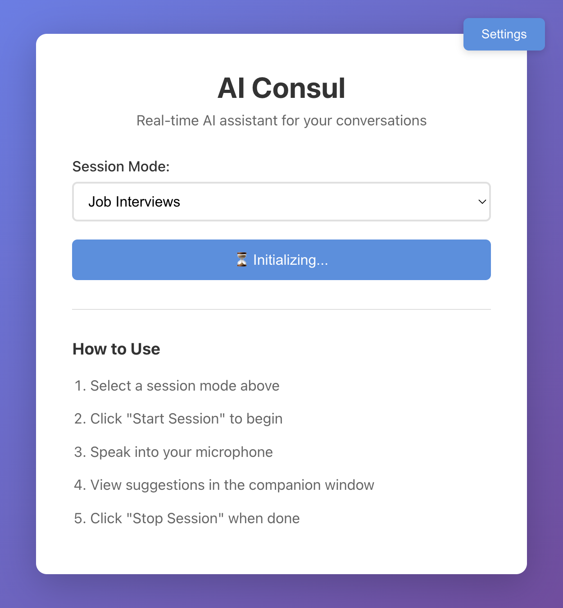
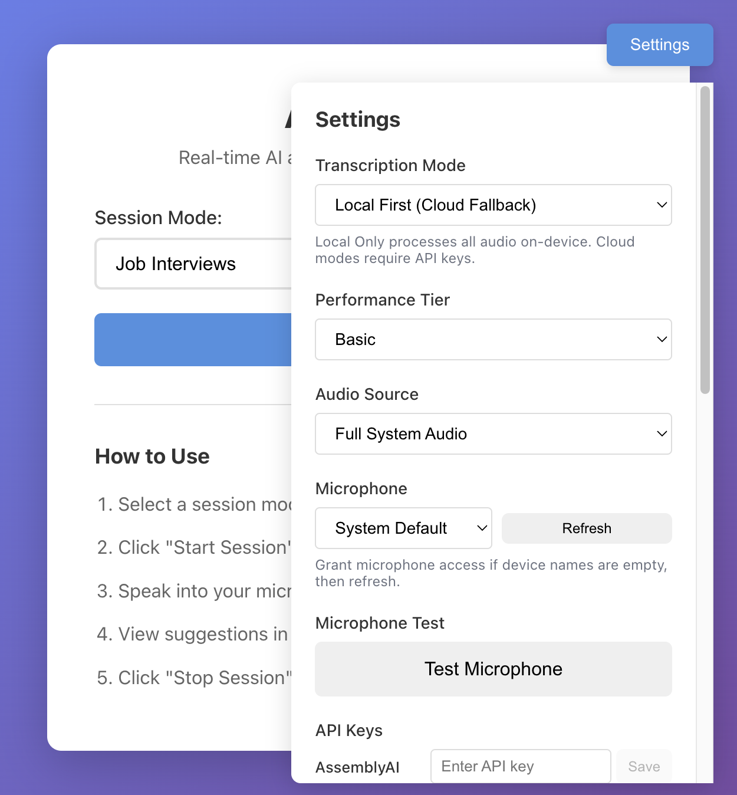
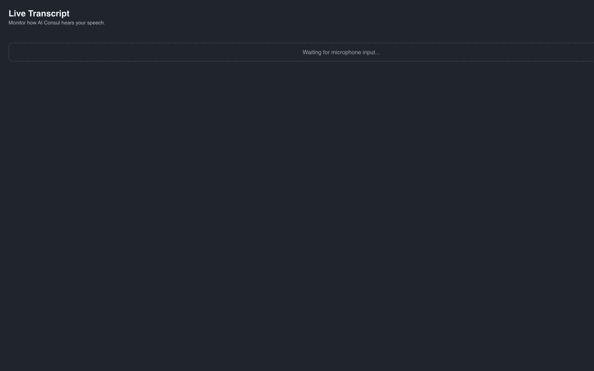
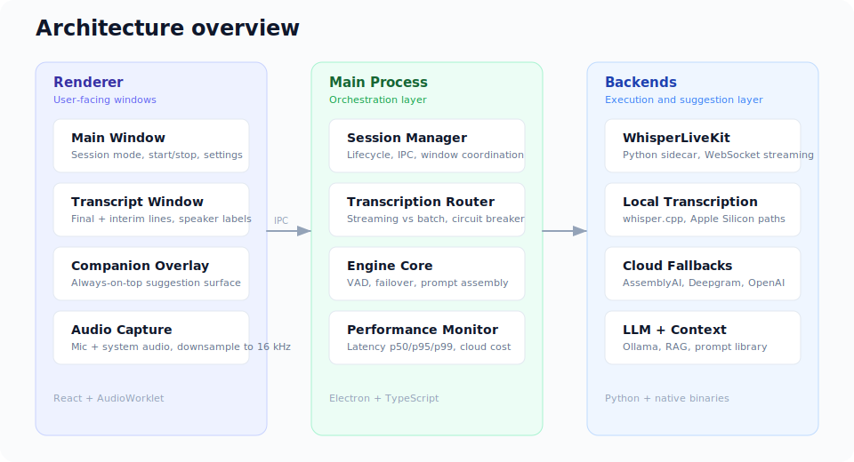
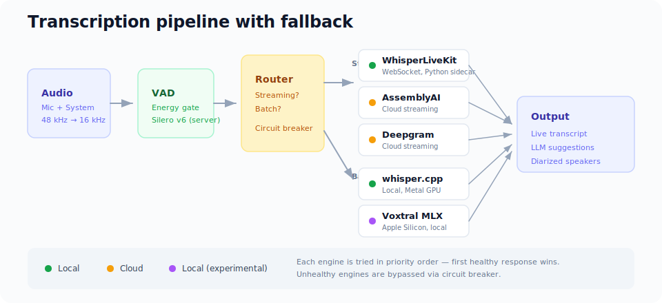

# AI Consul

A privacy-first, real-time AI assistant for conversations, interviews, meetings, and educational sessions.

Desktop product that captures live audio, routes transcription across local and hybrid backends, and surfaces real-time assistance in separate windows while a conversation is still happening.

## Problem

Most conversation assistants send audio to the cloud by default, hide failure modes, and give users no visibility into what the system is doing.

AI Consul takes a different approach:

- Local-first processing instead of cloud-first.
- Explicit privacy and fallback controls.
- Desktop-native multi-window experience.
- Visibility into cost, network, and engine status.

## What The Product Does

- Captures microphone input and optionally system audio.
- Mixes and downsamples audio before handing it to the transcription pipeline.
- Routes transcription through streaming or batch paths depending on availability.
- Supports multiple backends: WhisperLiveKit sidecar, local whisper.cpp, AssemblyAI, Deepgram.
- Generates concise, actionable suggestions using context and prompt logic.
- Surfaces output across a main window, transcript window, and companion overlay.

## Product Walkthrough

## Architecture

AI Consul runs as a multi-window Electron app. The renderer handles user-facing windows and browser-based audio capture. The main process manages session orchestration and IPC. The transcription layer attempts a streaming path first and falls back to batch processing when needed. Transcript output is combined with context and prompt logic before suggestions are pushed to the UI.

## Routing And Fallbacks

The core technical idea is the routing strategy, not a single model:

- Attempt the best available path first.
- Fall back without breaking the user experience.
- Keep local and cloud trade-offs visible instead of hidden.
- Treat resilience as part of the product.

## Stack

Electron, TypeScript, React, Python, whisper.cpp, Ollama
